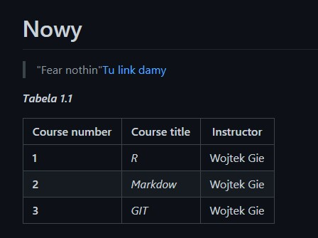

# Nowy
> "Fear nothin"	[Tu link damy](https://github.com/programming-for-data-science/book-exercises/tree/master/chapter-04-exercises/exercise-1)

**_Tabela 1.1_**
|Course number|Course title|Instructor|
|:-------------|:------------|:----------|
|**1**|_R_|Wojtek Gie|
|**2**|_Markdow_|Wojtek Gie|
|**3**|_GIT_|Wojtek Gie|

Dobrze wykonana tabrla powinna przypominać tą ze zdjęcia:

## What I've learnt so far...

### Command line functions: cd

Funkcja ma następującą składnię: `cd ~/Desktop`

Funkcja cd:
- umożliwia szybkie przejście z jednego folderu na drugi
- wskazuje na aktywny folder na którym przeprowadzane będą operacje
